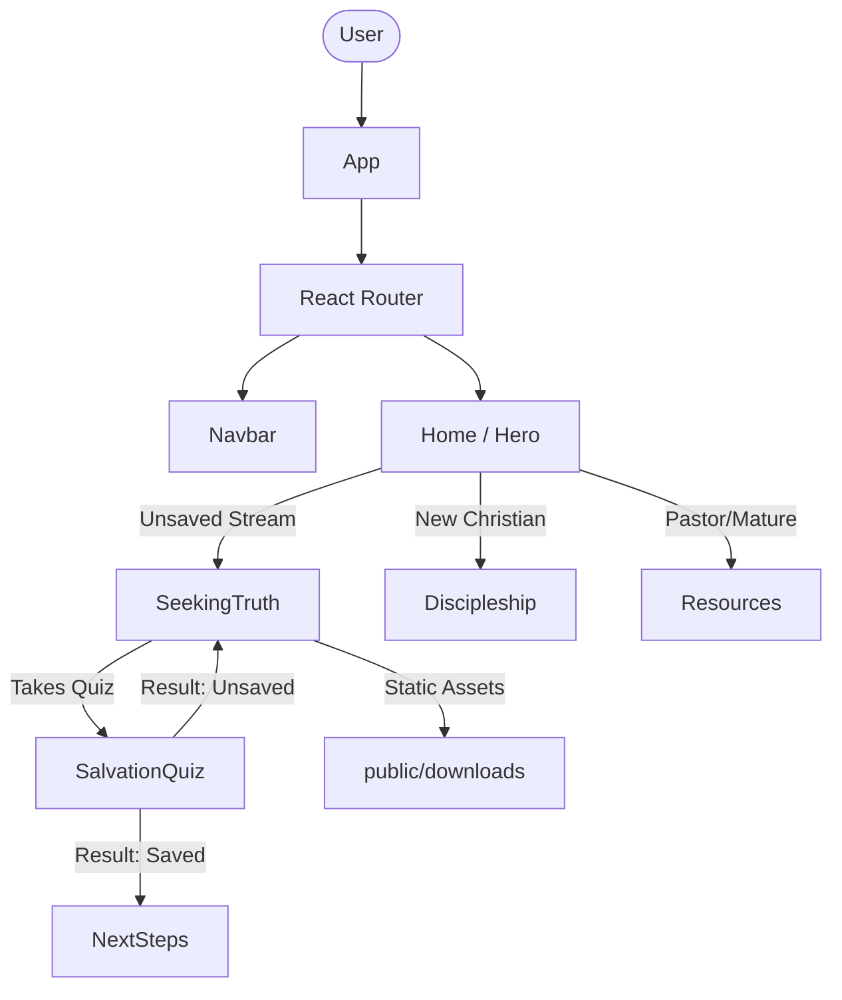

# Architecture

## File Map
| File | Role |
|---|---|
| `src/main.jsx` | React root rendering entry point. |
| `src/App.jsx` | Main routing setup and layout wrapper, imports all pages. |
| `src/components/Navbar.jsx` | Stream-based dropdown navigation component. |
| `src/pages/Home.jsx` | Hook hero entry point, offering the 3-stream selector cards. |
| `src/pages/SeekingTruth.jsx` | Unsaved-stream entry page with interactive Worldview Explorer. |
| `src/pages/Discipleship.jsx` | New Christian stream: structured Bible study paths. |
| `src/pages/Resources.jsx` | Pastor/Mature stream: general ministry resources. |
| `src/pages/SalvationQuiz.jsx` | Interactive quiz routing users based on answers. |
| `src/styles/index.css` | Global CSS and design tokens (CSS variables) for the theme. |

## Data Flow Diagram

## Key State Ownership
- **Quiz State (`SeekingTruth.jsx` / `SalvationQuiz.jsx`)**: Owned locally within the specific page components. Uses `useState` to track current step, answers, and analysis. This lives locally because the state is ephemeral and only relevant to the active user session within that specific component flow.
- **Intro Screen State (`App.jsx`)**: Owned in the root `App` component and persisted via `sessionStorage` (`introShown`). It ensures the introductory cinematic animation only plays once per session.
